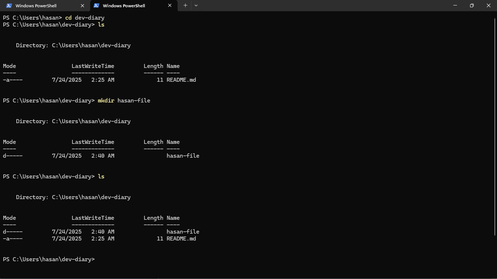

# 💻 My Dev Diary

## 👋 Beginning

Hello all ! My name is **`Hasan Alqadri`**, and I'm a passionate **Software Engineer**. I specialize in **quality assurance**, **Python programming**, and **data engineering**. I hold certifications in **QA Assurance** and **Python**, and I collaborate with **Chinese tech companies** on large-scale data projects.

### **My current work involves:**

- Collecting and processing **big data**

- Supporting **AI training pipelines**
- Performing **transcription tasks** for machine learning datasets

---

### What I Learned from the *Good Developer Mindset* Article

Reading the *Good Developer Mindset* article helped reinforce these key points:

- **Learning is continuous** — even experienced developers need to stay updated.
- **Asking for help is a strength**, not a weakness.
- **Testing early and often** prevents major setbacks.
- **Reading documentation** is crucial for efficiency and self-sufficiency.

>**(These insights remind me to stay humble, stay curious, and never stop improving my skills)**

---

### What I Learned from the *Terminal Command Cheat Sheet*

Reading the article helped me understand the key traits that shape a strong, growth-oriented developer. Here are the most important lessons I took away:

1. **Embrace Continuous Learning**  
   The tech world evolves fast. A good developer stays curious and always looks for ways to improve and learn new tools, languages, and techniques.

2. **Focus on Problem Solving, Not Just Knowing Everything**  
   You don’t need to memorize everything. What matters is the ability to break down a problem, search for answers, and figure things out under pressure.

3. **Ask for Help and Collaborate**  
   No one builds software alone. Communication and teamwork are essential. Don’t be afraid to ask for help or offer support to others.

4. **Own Your Mistakes**  
   Making mistakes is part of the process. What matters is taking responsibility, learning from them, and applying those lessons in future work.

5. **Stay Curious and Explore**  
   Good developers ask questions and dive deeper. They explore how things work, try new approaches, and go beyond the minimum.

Using the terminal effectively can save time and improve my workflow. I practiced the following commands:

- `pwd` – shows the current directory
- `ls` – lists files and folders
- `cd` – changes directories
- `mkdir` – creates a new folder
- `touch` – creates a new file
- `git add .` – stages all changes
- `git commit -m "message"` – commits changes
- `git push origin main` – pushes changes to GitHub

---

**Here’s a screenshot of the terminal while I was using these commands:**

---

### Markdown Features Used

- **Bold** text
- *Italic* text
- `Inline code` blocks
- Lists (ordered and unordered)
- Headers (H1–H3)
- Image embedding

---

### Examples of Lists

**Unordered List:**

- Python
- QA Assurance
- Big Data
- Transcription

**Ordered List:**

1. Clone the repository
2. Open it in VS Code
3. Add content to README.md
4. Push to GitHub

---

> 📌 **Consistent practice is essential for improvement...**
